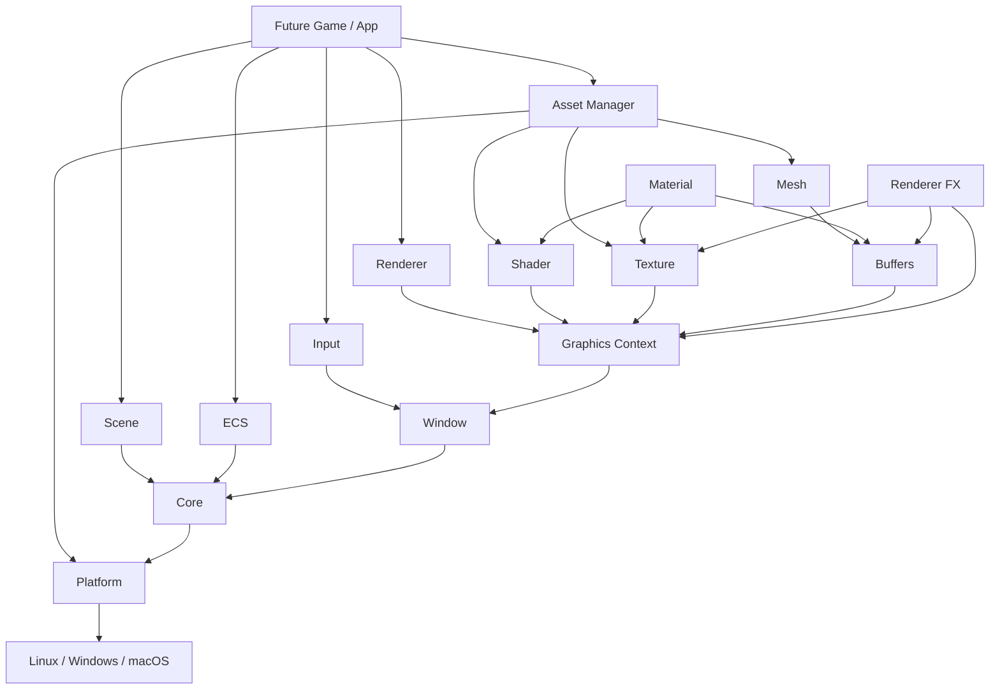

# Project Overview

## Purpose

Eisenfront is a custom game engine written in ISO C23. Its technical direction favors portability, modularity, explicit ownership, and long-term maintainability. The current repository is not a game yet; it is the engine foundation that a future game, editor, or demo would build on.

## Technical Principles

- Language: ISO C23.
- Build system: CMake.
- Target platforms: Linux, Windows, and macOS.
- Rendering API: OpenGL 4.6 core profile.
- Window, input, and context creation: SDL3, hidden behind engine APIs.
- Math: cglm.
- Image loading: stb_image.
- glTF parsing: cgltf.
- Testing: Unity Test Framework through CTest.
- Dependency direction: higher-level modules depend on lower-level modules, never the reverse.

## Current Repository Shape

```text
.
├── CMakeLists.txt
├── README.md
├── CLAUDE.md
├── docs/
├── engine/
│   ├── CMakeLists.txt
│   ├── include/eisenfront/
│   └── src/
├── tests/
├── third_party/
└── build/
```

`engine/include/eisenfront` contains the public API. `engine/src` contains implementations. `tests` contains module-level test executables. `third_party` contains local dependency wrappers or vendored dependencies. `build` is generated output.

## Engine Layers



## What Exists Today

- Modular engine libraries.
- Public headers with clear module contracts.
- Platform abstraction for OS services.
- Core lifecycle, logging, errors, assertions, modules, and timing.
- SDL-backed window and input modules.
- OpenGL context creation and GLAD loading.
- Renderer command queue.
- Shader, texture, buffer, mesh, material, asset, scene, camera, ECS, and renderer FX modules.
- A physics module in source form.
- CTest/Unity tests for the main modules.

## What Does Not Exist Yet

- Playable game executable.
- Official demo executable.
- Editor.
- `game/` directory with gameplay.
- Audio system.
- Networking system.
- UI system.
- Serialized scene format.
- Complete glTF material, animation, and skinning import.
- Complete high-level scene renderer.

## Glossary

| Term | Meaning |
|---|---|
| Public API | Headers in `engine/include/eisenfront` |
| Module | A focused engine library with a public contract |
| Opaque handle | Pointer to an incomplete struct used to hide implementation details |
| `Result` | Engine-wide error code enum |
| Refcount | Reference count used for shared resources |
| GL | OpenGL |
| DSA | Direct State Access, a modern OpenGL style |
| UBO | Uniform Buffer Object |
| ECS | Entity Component System |

