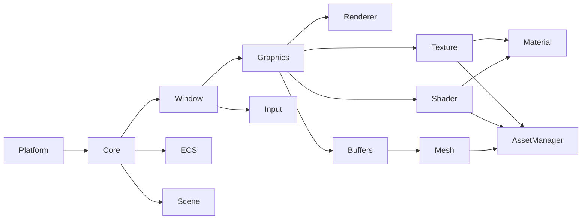
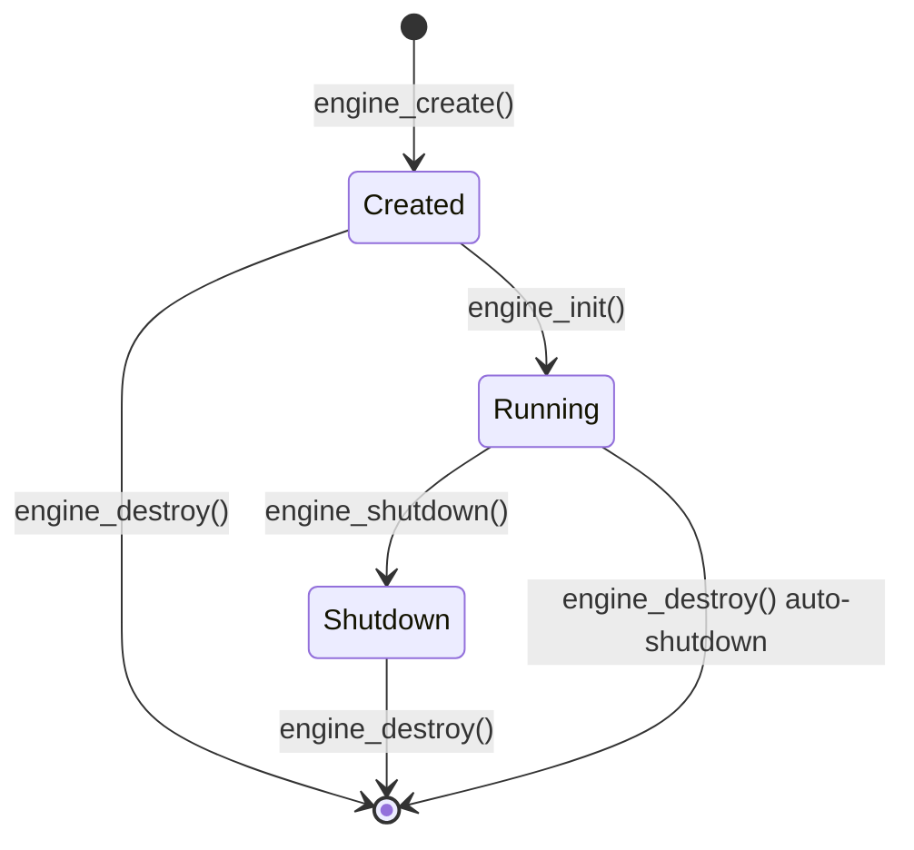
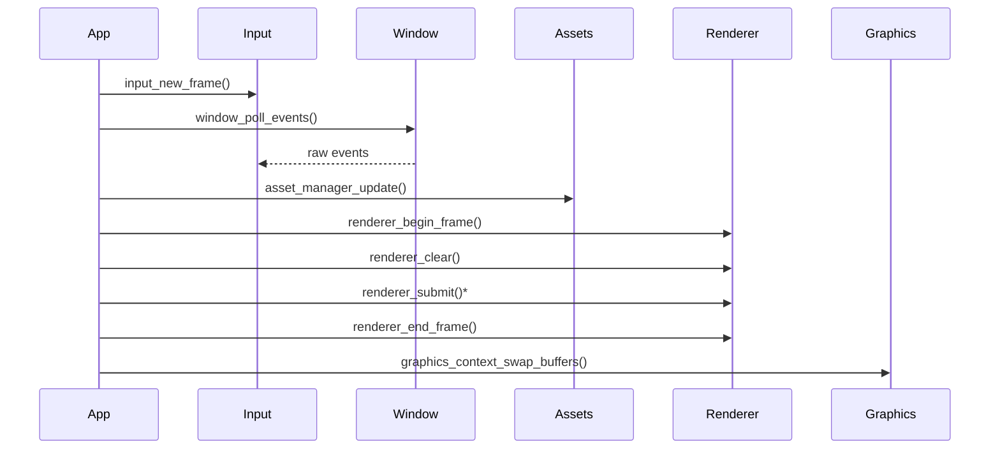
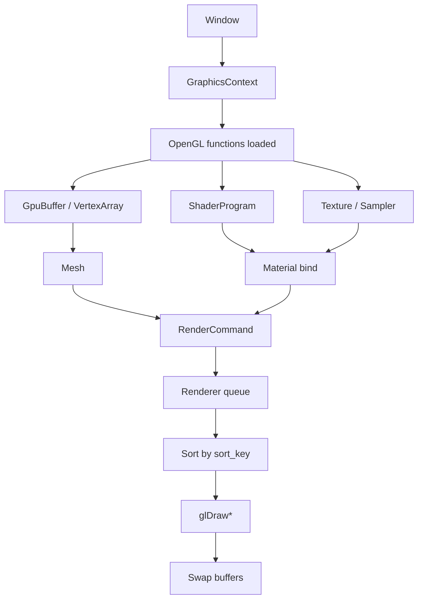
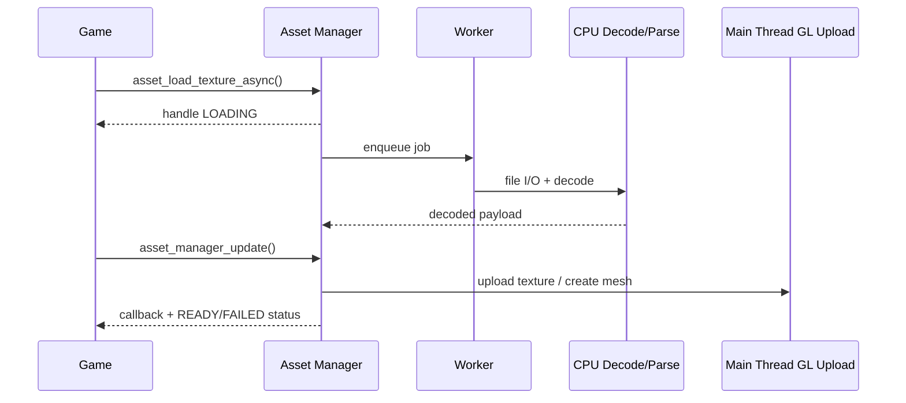

# Architecture

## Architectural Overview

Eisenfront is built in layers. `Platform` is the bottom layer. `Core` depends on it. Window, input, and graphics sit above core. Graphics resources and assets sit above the OpenGL context. Gameplay-facing systems such as Scene and ECS remain independent from raw rendering details.

The project tries to preserve a clean rule: gameplay should not call SDL or OpenGL directly.

## Dependency Rule

Read each arrow as "enables". For example, `Core --> Window` means Window depends on Core.

## Generated Libraries

`engine/CMakeLists.txt` defines the following static libraries:

| Library | CMake alias | Responsibility |
|---|---|---|
| `eisenfront_platform` | `Eisenfront::Platform` | Operating system abstraction |
| `eisenfront_core` | `Eisenfront::Core` | Engine lifecycle, logs, errors, timing, modules |
| `eisenfront_window` | `Eisenfront::Window` | SDL3-backed window API |
| `eisenfront_input` | `Eisenfront::Input` | Keyboard, mouse, and gamepad state |
| `eisenfront_graphics` | `Eisenfront::Graphics` | OpenGL 4.6 context and GLAD loading |
| `eisenfront_renderer` | `Eisenfront::Renderer` | Render command queue |
| `eisenfront_shader` | `Eisenfront::Shader` | Shader compilation, cache, reflection |
| `eisenfront_buffers` | `Eisenfront::Buffers` | GL buffers and vertex arrays |
| `eisenfront_texture` | `Eisenfront::Texture` | Textures, cubemaps, arrays, samplers |
| `eisenfront_mesh` | `Eisenfront::Mesh` | Reusable geometry |
| `eisenfront_asset_manager` | `Eisenfront::AssetManager` | Asset handles, cache, loading |
| `eisenfront_camera` | `Eisenfront::Camera` | Cameras and frustum math |
| `eisenfront_material` | `Eisenfront::Material` | PBR material state and instances |
| `eisenfront_scene` | `Eisenfront::Scene` | Transform hierarchy and scene transitions |
| `eisenfront_ecs` | `Eisenfront::Ecs` | Sparse-set ECS |
| `eisenfront_renderer_fx` | `Eisenfront::RendererFx` | Framebuffer, lighting, skybox, shadows, postprocess |

The `physics` source exists as `engine/include/eisenfront/physics.h` and `engine/src/physics/physics.c`, but it is not connected to the observed main engine CMake file.

## Engine Lifecycle

Rules:

- Modules are registered while the engine is in `ENGINE_STATE_CREATED`.
- `engine_init()` initializes modules in registration order.
- If initialization fails, already-started modules are unwound in reverse order.
- `engine_shutdown()` shuts modules down in LIFO order.
- `engine_destroy()` frees the engine and auto-shuts-down if needed.

## Expected Frame Loop

This is the likely shape of a future game executable.

## Rendering Flow

The renderer does not own GL resources. It receives GL object names and executes render commands. Resource ownership stays in Shader, Texture, Buffers, Mesh, Material, and related modules.

## Async Asset Flow

Shaders do not have an async path because shader compilation is itself an OpenGL operation.

## Ownership Model

Common patterns:

- Opaque objects created with `*_create` are destroyed with `*_destroy`.
- Shared resources use `*_retain` and `*_release`.
- Fallible functions return `Result`.
- Caller-owned data is copied when the API says the module does not retain it.
- Asset handles expose the underlying resource only when the asset is ready.

## Error Model

`Result` is the shared error contract:

| Code | General meaning |
|---|---|
| `RESULT_OK` | Success |
| `RESULT_ERROR_INVALID_ARGUMENT` | Invalid input |
| `RESULT_ERROR_OUT_OF_MEMORY` | Allocation failed |
| `RESULT_ERROR_NOT_INITIALIZED` | System not initialized |
| `RESULT_ERROR_ALREADY_INITIALIZED` | Duplicate initialization |
| `RESULT_ERROR_NOT_FOUND` | Missing resource |
| `RESULT_ERROR_ALREADY_EXISTS` | Duplicate resource |
| `RESULT_ERROR_CAPACITY_EXCEEDED` | Fixed capacity exceeded |
| `RESULT_ERROR_INVALID_STATE` | Current state does not allow the operation |
| `RESULT_ERROR_PERMISSION_DENIED` | Permission denied |
| `RESULT_ERROR_IO` | I/O failure |
| `RESULT_ERROR_TIMEOUT` | Timeout |
| `RESULT_ERROR_NOT_SUPPORTED` | Unsupported operation |
| `RESULT_ERROR_PLATFORM` | OS, driver, or platform failure |
| `RESULT_ERROR_MODULE_INIT_FAILED` | Module initialization failed |

## External Dependencies

| Library | Role | Exposure |
|---|---|---|
| SDL3 | Window, input, GL context | Private to Window/Input/Graphics |
| GLAD | OpenGL loader | Public through Graphics |
| cglm | Math | Public in Camera/Scene/Physics/Renderer FX |
| stb_image | Image decoding | Private to Texture |
| cgltf | glTF parsing | Private to Asset Manager |
| Unity | Unit tests | Tests only |

## Design Tradeoffs

- Explicit APIs instead of hidden global behavior.
- Small modules instead of a monolithic engine library.
- Fixed capacities in several systems to avoid reallocations and pointer invalidation.
- Path-keyed caches for shaders, textures, and assets.
- SDL hidden from public gameplay APIs.
- OpenGL hidden from gameplay, but intentionally available to internal rendering modules.

