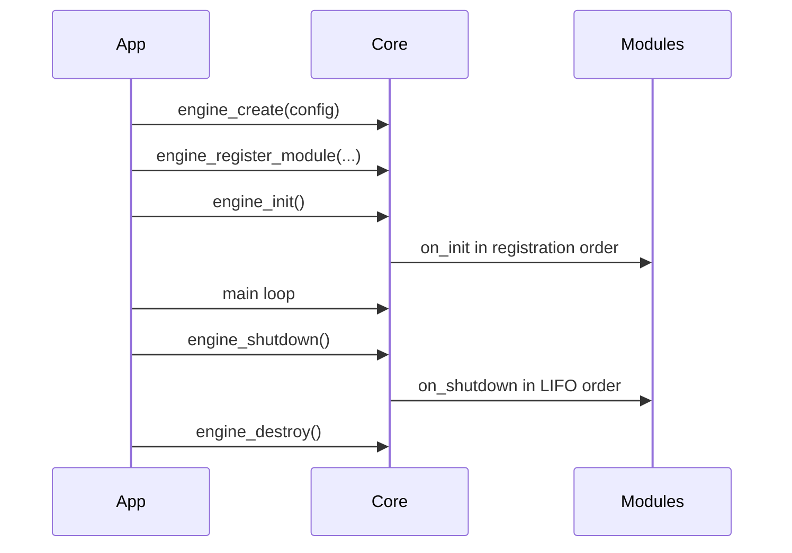
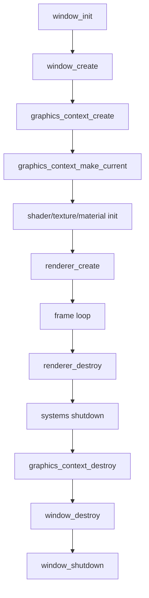
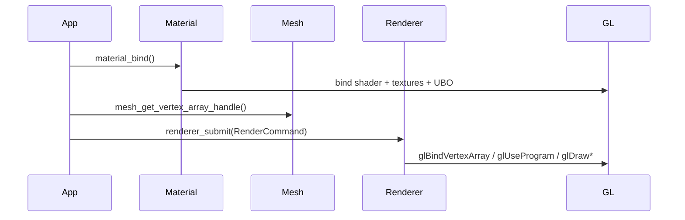
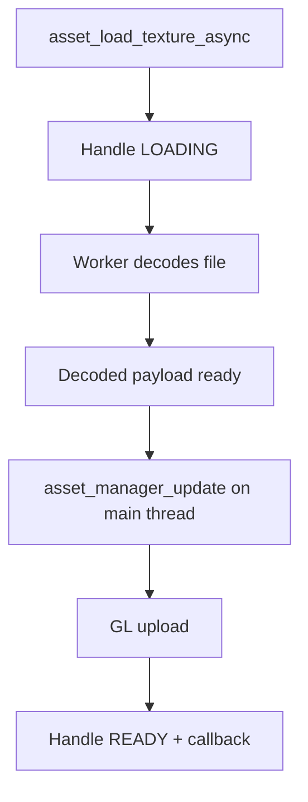
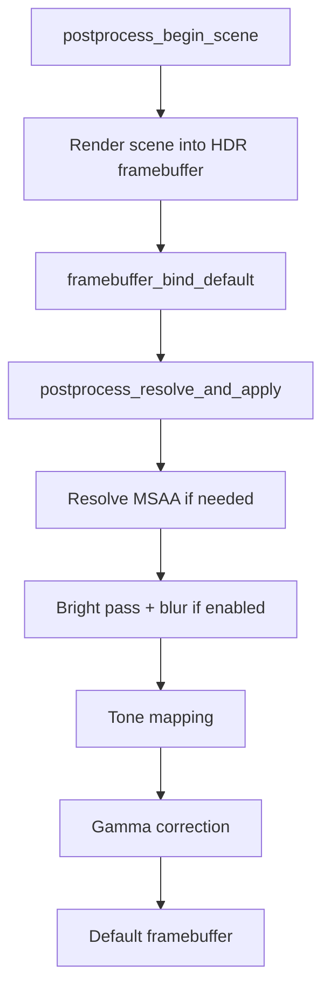

# Engine Usage Flows

This document shows how the modules fit together in a future application. The examples are conceptual and use the current public APIs.

## Minimal Engine Initialization



## Window + GL Context + Renderer

Expected order:

1. `window_init()`.
2. `window_create()`.
3. `graphics_context_create()`.
4. `graphics_context_make_current()`.
5. Initialize GL-dependent systems such as shader, texture, and material.
6. `renderer_create()`.
7. Run the loop.
8. Destroy renderer, context, and window in reverse order.



## Per-Frame Input

Input depends on call order:

```c
input_new_frame();
window_poll_events();

if (input_key_pressed(KEY_ESCAPE)) {
    window_request_close(window);
}
```

`input_new_frame()` snapshots the previous state and clears deltas. `window_poll_events()` delivers new events. `pressed` and `released` queries only make sense after both calls.

## Basic Render Frame

```c
renderer_begin_frame(renderer);

ClearParams clear = clear_params_default();
clear.flags = CLEAR_FLAG_COLOR | CLEAR_FLAG_DEPTH;
clear.red = 0.02f;
clear.green = 0.02f;
clear.blue = 0.025f;
clear.alpha = 1.0f;
renderer_clear(renderer, &clear);

renderer_submit(renderer, &command);

renderer_end_frame(renderer);
graphics_context_swap_buffers(context);
```

## Rendering With Material And Mesh

Conceptual flow:



`Material` prepares shading state. `Mesh` provides VAO and counts. `Renderer` executes the draw.

## Synchronous Assets

Use synchronous loads when:

- The resource is small.
- The app is already on a loading screen.
- Blocking the caller is acceptable.

Example shape:

```c
AssetHandle *handle = nullptr;
Result result = asset_load_texture("assets/diffuse.png", &params, &handle);
if (result == RESULT_OK && asset_get_status(handle) == ASSET_STATUS_READY) {
    Texture *texture = asset_get_texture(handle);
}
asset_release(handle);
```

## Async Assets

Use async loads when:

- The resource may be slow.
- The game must continue running.
- GL upload can wait until the next main-thread asset update.



Main contract: call `asset_manager_update()` once per frame on the main thread.

## Scene

Typical shape:

```c
Scene *scene = nullptr;
scene_create(1024, &scene);

SceneNodeDesc desc = scene_node_desc_default();
desc.name = "Player";
SceneNodeId player = SCENE_INVALID_NODE_ID;
scene_node_create(scene, &desc, &player);

scene_update_transforms(scene);
```

Call `scene_update_transforms()` before reading world matrices.

## ECS

Typical shape:

```c
World *world = nullptr;
WorldDesc desc = world_desc_default();
world_create(&desc, &world);

ComponentTypeId transform_type;
world_register_component_type(world, sizeof(TransformComponent), &transform_type);

Entity entity;
entity_create(world, &entity);
ecs_add_component(world, entity, transform_type, &transform);

world_update(world, delta_time);
```

Queries iterate the smallest requested component pool and use sparse-set lookup for the remaining component types.

## Post-Processing

HDR/bloom flow:



## Directional Shadow Map

Flow:

1. Create `ShadowMap`.
2. Call `shadow_map_set_light()`.
3. Call `shadow_map_begin()`.
4. Draw scene geometry with `shadow_map_draw()`.
5. Use `shadow_map_get_depth_texture()` in an application-provided lit shader.

Current limit: shadow maps are scoped to one directional light and do not implement cascaded shadows.

